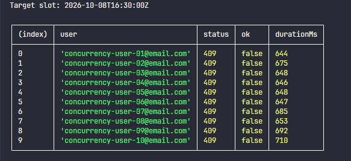
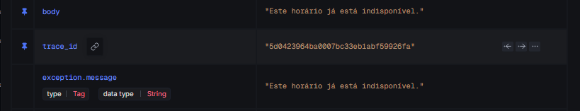
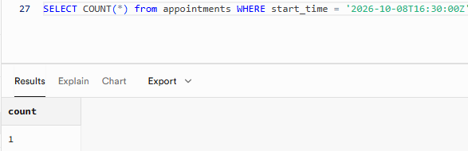

# Appointment System

## Overview

Appointment System is a full-stack scheduling application designed to reduce manual coordination in appointment workflows. It allows users to request available time slots while administrators manage confirmations, visibility, and operational control from a centralized interface.

## Product Vision

The product is designed to reduce back-and-forth scheduling, organize appointments in one place, and separate responsibilities between users and administrators. Users can request and manage their own appointments, while admins can review the full schedule, confirm requests, and keep operational control over availability.

## Main Features

- User registration and login
- JWT authentication
- Appointment creation
- Available slot listing
- User appointment listing
- Appointment cancellation
- Admin appointment listing
- Admin appointment confirmation
- Audit logging for key auth and appointment events
- OpenTelemetry tracing for backend workflows
- Log-to-trace correlation with SigNoz
- Concurrent booking validation for appointment integrity

## User Roles

- `USER`: can create appointments, view their own appointments, and cancel their own appointments.
- `ADMIN`: can view all appointments and confirm appointment requests.

## Tech Stack

**Frontend**

- React
- Vite
- TypeScript
- React Router
- Axios
- Tailwind CSS
- React Hook Form
- Zod

**Backend**

- TypeScript
- Fastify
- Knex
- JWT
- bcrypt
- OpenTelemetry

**Database**

- PostgreSQL
- `btree_gist` extension for appointment overlap protection

**Observability**

- SigNoz
- OpenTelemetry traces
- Structured backend logs
- Log-to-trace correlation
- PostgreSQL query spans

**Testing / Validation**

- Vitest
- Zod
- Concurrent request simulation

## Architecture

The backend follows a layered structure:

- `domain`: entities, value objects, domain rules, errors, and repository interfaces
- `application`: use cases and DTOs
- `infrastructure`: database access, migrations, seeds, app setup, telemetry, and services
- `interfaces`: HTTP routes, controllers, middleware, and request schemas

The frontend is organized around:

- `pages`: route-level screens
- `components`: reusable UI and layout components
- `services`: API client and endpoint wrappers
- `hooks`: stateful auth and appointment workflows
- `utils`: formatting and timezone helpers

## Running Locally

### Backend

```bash
cd backend
npm install
npm run migrate
npm run seed
npm run dev
```

### Frontend

```bash
cd frontend
npm install
npm run dev
```

## Environment Variables

### Backend

```env
DB_HOST=
DB_PORT=
DB_NAME=
DB_USER=
DB_PASSWORD=
JWT_SECRET=
ADMIN_EMAIL=
ADMIN_PASSWORD=
PORT=
NODE_ENV=
OTEL_ENABLED=
OTEL_SERVICE_NAME=
OTEL_EXPORTER_OTLP_ENDPOINT=
```

Example local observability configuration:

```env
OTEL_ENABLED=true
OTEL_SERVICE_NAME=schedulr-backend
OTEL_EXPORTER_OTLP_ENDPOINT=http://localhost:4318
```

OpenTelemetry is optional and can be enabled locally by pointing the backend to an OTLP-compatible collector such as SigNoz.

### Frontend

```env
VITE_API_URL=
```

If `VITE_API_URL` is not set, the frontend defaults to `http://localhost:3000/api/v1`.

## Tests and Build

### Backend

```bash
npm test
npm run test:coverage
npm run build
```

### Frontend

```bash
npm run lint
npm run build
```

## Project Highlights

- Clean separation of responsibilities across backend layers
- Fastify API with structured controllers, schemas, and middleware
- Domain rules isolated from the HTTP layer
- Role-based access control for users and admins
- PostgreSQL exclusion constraint for appointment overlap protection
- Zod validation for API input handling
- JWT-based authentication
- Backend test coverage for core business behavior
- OpenTelemetry tracing and SigNoz observability for backend workflows
- Log-to-trace correlation for request-level debugging
- Concurrent booking validation with multiple authenticated users
- Controlled `409 Conflict` responses for unavailable appointment slots

## Observability and Concurrency Validation

The appointment creation flow was instrumented with OpenTelemetry and analyzed locally using SigNoz.

The validation scenario simulated:

- 10 distinct users
- 10 independent JWTs
- 10 simultaneous appointment requests
- The same appointment slot

PostgreSQL preserves scheduling integrity through the `no_overlapping_appointments` exclusion constraint.

During validation, overlapping appointment attempts were mapped to domain-level conflict errors instead of generic internal server errors. The backend now returns controlled `409 Conflict` responses for unavailable slots while keeping PostgreSQL as the final integrity guard.

Final validated behavior:

```text
1 request  → 201 Created
9 requests → 409 Conflict
0 requests → 500 Internal Server Error
1 appointment stored in PostgreSQL
```

### Evidence

#### Final Concurrency Validation

The final concurrency simulation confirmed that only one request creates the appointment while the remaining concurrent requests receive controlled conflict responses.



#### Log-to-Trace Correlation

Structured backend logs include a `trace_id`, allowing the related distributed trace to be opened directly in SigNoz for request-level investigation.



#### Database Integrity Verification

Only one appointment is stored for the tested slot, confirming that database integrity is preserved under concurrent booking attempts.



## Repository Structure

```text
backend/
frontend/
docs/
  observability/
    screenshots/
      01-concurrency-after-fix.png
      02-log-trace-correlation.png
      03-database-single-appointment.png
AGENTS.md
README.md
```
